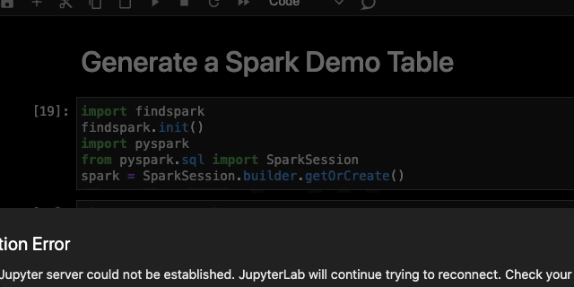

# JupyterLab Integration

## Install

JupyterLab supports `sql-language-server`. More details here
https://jupyterlab-lsp.readthedocs.io/en/latest/Language%20Servers.html

All that is required is for sql-language-server to be installed.

```bash
$ npm install --save-dev sql-language-server
```

When you create a %%sql cell
- screen shot %%sql cell, syntax highlighing, code server initialized.


## sqlite3

In order to execute %%sql cells you need to install the IPython sql magic.

```bash
$ pip3 install ipython-sql
```

In order to code complete your SQL statement you need to configure `sql-language-server` using JupyterLab's Advanced Settings.

> Advanced Settings Editor -> Language Server

Assuming you have an sqlite3 database file at `/tmp/demodb.sqlite` enter the following configuration:
```json
{
    "language_servers": {
        "sql-language-server": {
            "serverSettings": {
                "sqlLanguageServer": {
                    "connections": [
                        {
                            "name": "sqlite-conf",
                            "adapter": "sqlite3",   
                            "filename": "/tmp/demodb.sqlite"
                        }
                    ]
                }
            }
        }
    }
}
```

- completion demo video, you can now code complete and execute the SQL


## spark

### Generate Schema

- screen shot generation of schema
link to notebook showing how to generate

- sample of schema file
```json
  "functions": [
        {
            "name": "array_contains",
            "description": "Function: array_contains\nClass: org.apache.spark.sql.catalyst.expressions.ArrayContains\nUsage: array_contains(array, value) - Returns true if the array contains the value.\nExtended Usage:\n    Examples:\n      > SELECT array_contains(array(1, 2, 3), 2);\n       true\n  \n    Since: 1.5.0\n"
        },
  ...
  ],
  "tables":[
  		{
			"database": null,
			"tableName": "student",
  			"columns":[
              {
                "columnName": "books",
                "description": "array",
                "metadata": {},
                "type": "array"
              },
              {
                "columnName": "books.title",
                "description": "string",
                "metadata": {},
                "type": "string"
              },
              {
                "columnName": "books.chapters",
                "description": "array",
                "metadata": {},
                "type": "array"
              },
            ]
          }
```

- configuration

In order to code complete your SQL statement you need to configure `sql-language-server` using JupyterLab's Advanced Settings.

> Advanced Settings Editor -> Language Server

Assuming you have generated your schema at `/tmp/sparkdb.schema.json` enter the following configuration:

```json
{
    "language_servers": {
        "sql-language-server": {
            "serverSettings": {
                "sqlLanguageServer": {
                    "connections": [
                        {
                            "name": "pyspark-conf",
                            "adapter": "json",   
                            "filename": "/tmp/sparkdb.schema.json"
                        }
                    ]
                }
            }
        }
    }
}
```

- install pyspark_sql magic
```bash
$ pip install sparksql-magic
```

- alias %%sparksql to be %%sql

- completion demo video
functions
columns
subscripts


## Liting

works same as in VSCode


```
{
    "language_servers": {
        "sql-language-server": {
            "serverSettings": {
                "sqlLanguageServer": {
                    "connections": [
                        {
                            "name": "pyspark-conf",
                            "adapter": "json",   
                            "filename": "/tmp/sparkdb.schema.json"
                        }
                    ],
                        
                    "lint": {
                        "rules": {
                            "align-column-to-the-first": "error",
                            "column-new-line": "error",
                            "linebreak-after-clause-keyword": "off",
                            "reserved-word-case": [
                                "error",
                                "upper"
                            ],
                            "space-surrounding-operators": "error",
                            "where-clause-new-line": "error",
                            "align-where-clause-to-the-first": "error"
                        }
                    }
                }
            }
        }
    }
}
```


## SQL Support in Python Strings

reference other project